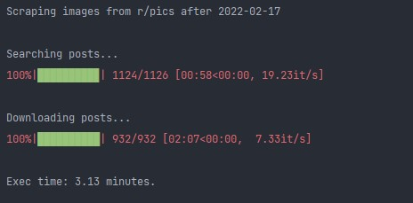

<h1 align="center">Subreddit Media Downloader</h1>

<h4 align="center">Download images and videos from any public subreddit without using Reddit's API</h4>
  

  Made with ❤ by Nico
  

# 💬 About:
This script allows you to download directly linked images, videos and gifs from any public subreddit **WITHOUT USING REDDIT'S API**.

How is this achieved? By using the very powerful [PushShift API](https://github.com/pushshift/api). This is important for a number of reasons:

* With Reddit's api, you have a limit of 1000 posts, pushshift is unlimited.
* In my experience, pushshift is just faster.
* You don't need a client id and secret, [which is tedious to create](https://praw.readthedocs.io/en/stable/getting_started/authentication.html) and can be hard if it's your first time.
  * Actually...you don't need any authentication at all!

There is one caveat tho, some of PushShift shards (think of them as servers) are sometimes down,
so you might not get the whole data in those cases. However, you're probably getting more than with Reddit's api, so it's worth it 😁  

# ✨ Features:
* 🖼️ Download directly linked images and gifs from any public subreddit.
* 🎞️ Download directly linked videos from any public subreddit.
* 📅 Download files before and/or after a certain date.

# 🔧 Setup:
Install the dependencies:

`python -m pip install -r requirements.txt`

Fill in the `config.ini` file as needed. There you can set:
    
* Subreddit you'll download your media from.
* Destination folder. 
* Posts time frame (optional).

# 🖥️ Usage:
Simply run the file `main.py` and it will start downloading.

 

# 📚 Dependencies:
* [**PSAW**](https://github.com/dmarx/psaw): Pushshift.io API Wrapper.
* [**tqdm**](https://github.com/tqdm/tqdm): Progressbar.
* [**aiohttp**](https://github.com/aio-libs/aiohttp): Async http client/server framework.
* [**aiofiles**](https://github.com/Tinche/aiofiles): File support for asyncio.
* [**ffmpeg-python**](https://github.com/kkroening/ffmpeg-python): Python bindings for FFmpeg.

# 📃 License:
[GNU General Public License v3.0](LICENSE).